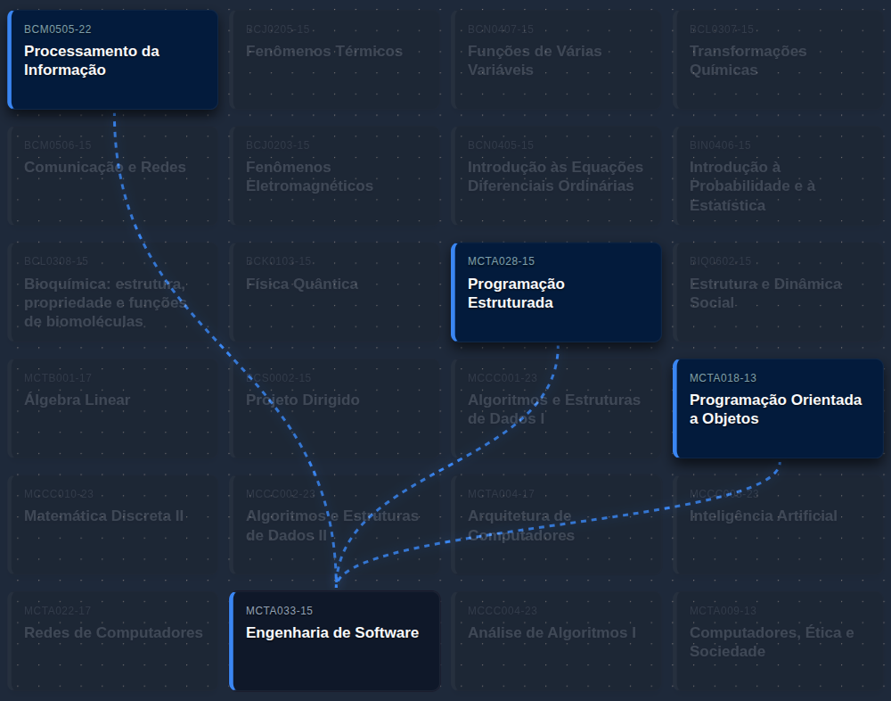

# 🚀 UFABC Flux
UFABC Flux é uma ferramenta de visualização interativa para as matrizes curriculares da Universidade Federal do ABC. O projeto permite que os alunos naveguem pelas dependências de disciplinas (pré-requisitos) de forma visual, facilitando o planejamento acadêmico e a tomada de decisão durante os períodos de matrícula.

## ✨ Funcionalidades
- **Grafo Interativo:** Visualização clara das conexões entre disciplinas.

- **Destaque de Dependências:** Ao selecionar ou passar o mouse em um nó, o fluxo de pré-requisitos é iluminado.

- **Interface Minimalista:** Design focado em produtividade, com tema escuro inspirado em ambientes de desenvolvimento.

- **Filtros Inteligentes:** (Em desenvolvimento) Capacidade de visualizar fluxos específicos de cursos (BCT, BCC, etc).

  

## 🛠️ Tecnologias Utilizadas
O projeto foi construído focando em performance e manutenibilidade:

- **React + Vite & JavaScript & TypeScript:** Desenvolvimento da SPA (Single Page Application) com foco em performance e segurança de tipos.

- **React Flow:** Biblioteca core para renderização e interação com o grafo de disciplinas.

- **C++ (CPP):** Linguagem escolhida para o desenvolvimento do parser customizado, responsável por processar e validar as complexas regras de pré-requisitos extraídas dos documentos oficiais.

- **SQL:** Utilizado para a modelagem relacional das matrizes curriculares, garantindo a integridade dos dados entre disciplinas, quadrimestres e créditos.

- **CSS Moderno:** Estilização minimalista e reativa com foco em feedback visual de baixa latência.